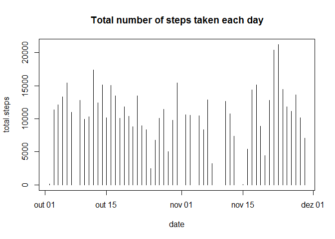
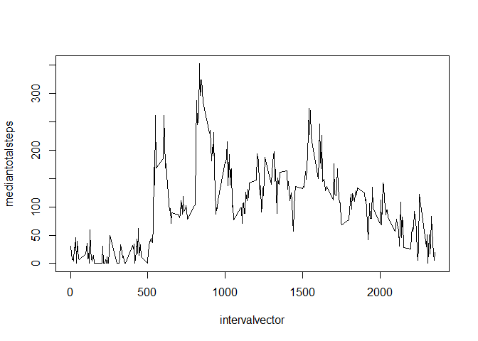
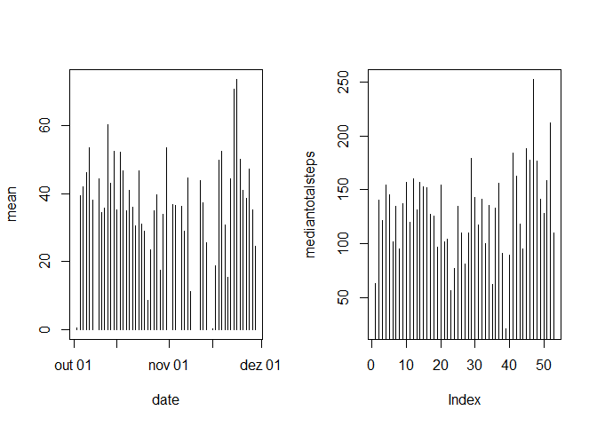

# Reproducible Research: Peer Assessment 1


###Loading and preprocessing the data

###Show any code that is needed to

1. Load the data (i.e. read.csv())


```r
rawactivity <- read.csv(unzip("activity.zip"))
```

2. Process/transform the data (if necessary) into a format suitable for your analysis


```r
rawactivity$date <- as.Date(rawactivity$date, "%Y-%m-%d")
```

###What is mean total number of steps taken per day?

For this part of the assignment, you can ignore the missing values in the dataset.

1. Calculate the total number of steps taken per day


```r
cleandata <- rawactivity[complete.cases(rawactivity),]

datevector <- unique(as.Date(cleandata$date, "%Y-%m-%d"))

totalsteps <- vector()
datetotalsteps <- vector()
index <- 1

for (i in 1:length(datevector)){
        if (is.na(sum(cleandata[cleandata[, "date"] ==  eval(datevector[i]),][,1])) == FALSE){
                totalsteps[index] <- sum(cleandata[cleandata[, "date"] ==  eval(datevector[i]),][,1])
                datetotalsteps[index] <- as.character(datevector[i])
                index <- index + 1
        }
}

sumdata <- data.frame(date=as.Date(datetotalsteps, "%Y-%m-%d"), total.steps=totalsteps, stringsAsFactors = FALSE)
```

2. Make a histogram of the total number of steps taken each day.


```r
 plot(sumdata, type = "h", main = "Total number of steps taken each day")
```

 


3. Calculate and report the mean and median of the total number of steps taken per day


```r
## mean
meantotalsteps <- vector()
datetotalsteps <- vector()
index <- 1

for (i in 1:length(datevector)){
        if (is.na(mean(cleandata[cleandata[, "date"] ==  eval(datevector[i]),][,1])) == FALSE){
                meantotalsteps[index] <- mean(cleandata[cleandata[, "date"] ==  eval(datevector[i]),][,1])
                datetotalsteps[index] <- as.character(datevector[i])
                index <- index + 1
        }
}

meandata <- data.frame(date=as.Date(datetotalsteps, "%Y-%m-%d"), mean=meantotalsteps, stringsAsFactors = FALSE)

## median

stepsperday <- vector()
sumstepsperday <- vector()
mediantotalsteps <- vector()
mediandatetotalsteps <- vector()
countmeasurestepsperday <- vector()
index <- 1
indexsteps <- 1

for (i in 1:length(datevector)){
        stepsperday <-  cleandata[cleandata[, "date"] ==  eval(datevector[i]),][,1]
        countmeasure <- 0
        sumsteps <- 0
        for (j in 1:length(stepsperday)) {
                if (stepsperday[j] > 0){
                        sumsteps <- sumsteps + stepsperday[j]
                        countmeasure <- countmeasure + 1
                }
        }
        mediantotalsteps[index] <- sumsteps / countmeasure
        mediandatetotalsteps[index] <- as.character(datevector[i])
        countmeasurestepsperday[index] <- countmeasure
        sumstepsperday[index] <- sumsteps
        index <- index + 1        
}

medianstepsperday <- data.frame(date=as.Date(datetotalsteps, "%Y-%m-%d"), median=mediantotalsteps, stringsAsFactors = FALSE)

reportmeanmedian <- merge(meandata, medianstepsperday)

reportmeanmedian
```

```
##          date    mean median
## 1  2012-10-02  0.4375  63.00
## 2  2012-10-03 39.4167 140.15
## 3  2012-10-04 42.0694 121.16
## 4  2012-10-05 46.1597 154.58
## 5  2012-10-06 53.5417 145.47
## 6  2012-10-07 38.2465 101.99
## 7  2012-10-09 44.4826 134.85
## 8  2012-10-10 34.3750  95.19
## 9  2012-10-11 35.7778 137.39
## 10 2012-10-12 60.3542 156.59
## 11 2012-10-13 43.1458 119.48
## 12 2012-10-14 52.4236 160.62
## 13 2012-10-15 35.2049 131.68
## 14 2012-10-16 52.3750 157.12
## 15 2012-10-17 46.7083 152.86
## 16 2012-10-18 34.9167 152.36
## 17 2012-10-19 41.0729 127.19
## 18 2012-10-20 36.0938 125.24
## 19 2012-10-21 30.6285  96.93
## 20 2012-10-22 46.7361 154.71
## 21 2012-10-23 30.9653 101.34
## 22 2012-10-24 29.0104 104.44
## 23 2012-10-25  8.6528  56.64
## 24 2012-10-26 23.5347  77.02
## 25 2012-10-27 35.1354 134.92
## 26 2012-10-28 39.7847 110.17
## 27 2012-10-29 17.4236  80.94
## 28 2012-10-30 34.0938 110.33
## 29 2012-10-31 53.5208 179.23
## 30 2012-11-02 36.8056 143.24
## 31 2012-11-03 36.7049 117.46
## 32 2012-11-05 36.2465 141.07
## 33 2012-11-06 28.9375 100.41
## 34 2012-11-07 44.7326 135.61
## 35 2012-11-08 11.1771  61.90
## 36 2012-11-11 43.7778 132.72
## 37 2012-11-12 37.3785 156.01
## 38 2012-11-13 25.4722  90.57
## 39 2012-11-15  0.1424  20.50
## 40 2012-11-16 18.8924  89.20
## 41 2012-11-17 49.7882 183.83
## 42 2012-11-18 52.4653 162.47
## 43 2012-11-19 30.6979 117.88
## 44 2012-11-20 15.5278  95.15
## 45 2012-11-21 44.3993 188.04
## 46 2012-11-22 70.9271 177.63
## 47 2012-11-23 73.5903 252.31
## 48 2012-11-24 50.2708 176.56
## 49 2012-11-25 41.0903 140.88
## 50 2012-11-26 38.7569 128.30
## 51 2012-11-27 47.3819 158.67
## 52 2012-11-28 35.3576 212.15
## 53 2012-11-29 24.4688 110.11
```

###What is the average daily activity pattern?

1. Make a time series plot (i.e. type = "l") of the 5-minute interval (x-axis) and the average number of steps taken, averaged across all days (y-axis)


```r
stepsperinterval <- vector()
sumstepsperinterval <- vector()
mediantotalsteps <- vector()
mediandatetotalsteps <- vector()
countmeasurestepsperinterval <- vector()
index <- 1
indexsteps <- 1
intervalvector <- unique(cleandata$interval)

for (i in 1:length(intervalvector)){
        stepsperinterval <-  cleandata[cleandata[, "interval"] ==  eval(intervalvector[i]),][,1]
        countmeasure <- 0
        sumsteps <- 0
        for (j in 1:length(stepsperinterval)) {
                if (stepsperinterval[j] > 0){
                        sumsteps <- sumsteps + stepsperinterval[j]
                        countmeasure <- countmeasure + 1
                }
        }
        if (countmeasure == 0) {
                mediantotalsteps[index] <- countmeasure        
        }else{
                mediantotalsteps[index] <- sumsteps / countmeasure        
        }
        countmeasurestepsperinterval[index] <- countmeasure
        sumstepsperinterval[index] <- sumsteps
        index <- index + 1        
}

plot(intervalvector,mediantotalsteps, type ="l")
```

 

2. Which 5-minute interval, on average across all the days in the dataset, contains the maximum number of steps?


```r
datasteps <- data.frame(median.steps=mediantotalsteps, interval=intervalvector, stringsAsFactors = FALSE)

maxsteps <- datasteps[order(datasteps$median.steps, na.last = NA, decreasing = TRUE),]

result <- head(maxsteps,1)[,2]
```

The 5-minute interval contains the maximum number of steps is 835


###3 Imputing missing values

###Note that there are a number of days/intervals where there are missing values (coded as NA). The presence of missing days may introduce bias into some calculations or summaries of the data.

1. Calculate and report the total number of missing values in the dataset (i.e. the total number of rows with NAs)


```r
tail(summary(rawactivity),1)[,1]
```

```
## [1] "NA's   :2304  "
```

2. Create a new dataset that is equal to the original dataset but with the missing data filled in.

```r
meandata <- data.frame(date=as.Date(datetotalsteps, "%Y-%m-%d"), mean=meantotalsteps, stringsAsFactors = FALSE)
```
3. Make a histogram of the total number of steps taken each day and Calculate and report the mean and median total number of steps taken per day. 
   Do these values differ from the estimates from the first part of the assignment? 
   What is the impact of imputing missing data on the estimates of the total daily number of steps?


```r
meantotalsteps <- vector()
datetotalsteps <- vector()
index <- 1

for (i in 1:length(datevector)){
        meantotalsteps[index] <- mean(rawactivity[rawactivity[, "date"] ==  eval(datevector[i]),][,1])
        datetotalsteps[index] <- as.character(datevector[i])
        index <- index + 1
}

meandata <- data.frame(date=as.Date(datetotalsteps, "%Y-%m-%d"), mean=meantotalsteps, stringsAsFactors = FALSE)

stepsperday <- vector()
sumstepsperday <- vector()
mediantotalsteps <- vector()
mediandatetotalsteps <- vector()
countmeasurestepsperday <- vector()
index <- 1
indexsteps <- 1

for (i in 1:length(datevector)){
        stepsperday <-  rawactivity[rawactivity[, "date"] ==  eval(datevector[i]),][,1]
        countmeasure <- 0
        sumsteps <- 0
        for (j in 1:length(stepsperday)) {
                if (is.na(stepsperday[j]) == FALSE){
                        if (stepsperday[j] > 0){
                                sumsteps <- sumsteps + stepsperday[j]
                                countmeasure <- countmeasure + 1
                        }
                }else{
                        countmeasure <- countmeasure + 1
                }
        }
        
        if (countmeasure == 0) {
                mediantotalsteps[index] <- countmeasure        
        }else{
                mediantotalsteps[index] <- sumsteps / countmeasure        
        }
        mediandatetotalsteps[index] <- as.character(datevector[i])
        countmeasurestepsperday[index] <- countmeasure
        sumstepsperday[index] <- sumsteps
        index <- index + 1        
}

medianstepsperday <- data.frame(date=as.Date(datetotalsteps, "%Y-%m-%d"), median=mediantotalsteps, stringsAsFactors = FALSE)

reportmeanmedian <- merge(meandata, mediantotalsteps)

par(mfrow = c(1,2))

plot(meandata, type ="h")
plot(mediantotalsteps, , type ="h")
```

 
